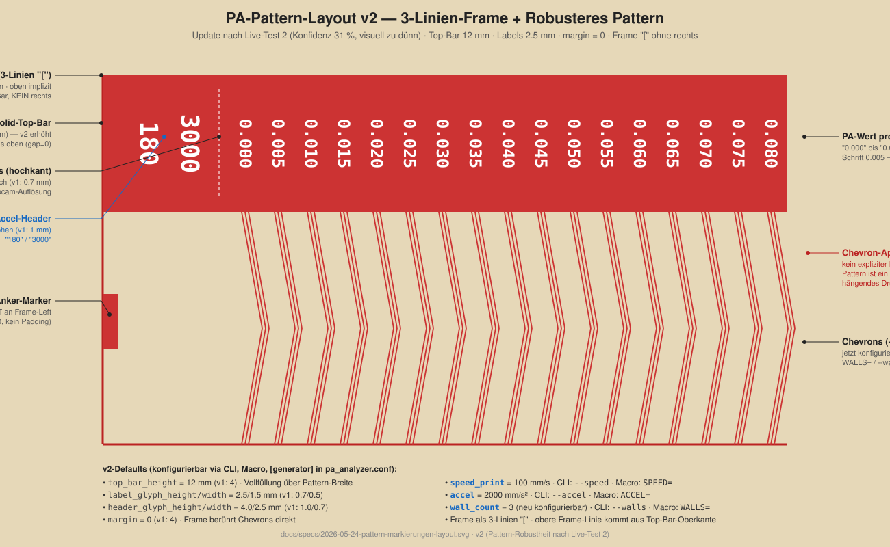

# Pattern-Markierungen + Speed/Accel-Parameter

**Datum:** 2026-05-24
**Status:** Spec (Brainstorming abgeschlossen, wartet auf User-Review vor `writing-plans`)
**Zusammenhang:** Adressiert die TODOs `[demnächst] Druck-Geschwindigkeit
und Beschleunigung als Parameter` und die nach dem ersten Live-Test
festgestellte Detection-Schwäche (siehe Memory-File `feature_progress_output_during_analysis.md`
und Konfidenz-Ergebnis 16 % im Report).

---

## Problem

Beim ersten Live-Test (2026-05-24) lieferte die Bild-Auswertung
`best_pa = 0.0124` bei nur **16 % Konfidenz** — die Score-Kurve war
fast komplett auf `1.0` gesättigt (nur ein einzelner Dip bei
`PA=0.015`). Wurzel-Analyse:

1. **Unser Generator emittiert keinen Solid-Top-Bar**, obwohl
   `src/pa_analyzer/orientation.py` (Docstring + Code) genau diesen
   Balken erwartet — Code: `frame_top = max(p.y for p in
   model.frame_box.corners)` und Vergleich `top_density / mid_density`.
   Ohne Top-Bar liefert das Verhältnis ~1.0 → orientation kann die
   richtige Rotation nicht eindeutig wählen. Das ist Mismatch zwischen
   Generator und Vision-Pipeline, der seit Etappe 2 existiert, aber
   bisher nicht aufgefallen ist (Spike validierte gegen
   OrcaSlicer-Output, der den Bar mitbringt).

2. **Keine visuelle Identifikation am gedruckten Pattern** — der User
   sieht 17 ">"-Chevrons in einer Reihe, ohne erkennen zu können,
   welcher zu welchem PA-Wert gehört. Bei einem 16-%-Konfidenz-Ergebnis
   ist visuelle Kreuz-Prüfung („welcher Chevron ist *optisch* der
   sauberste?") unmöglich.

3. **Druckgeschwindigkeit und Beschleunigung sind hartcodiert**
   (`speed_print = 60 mm/s`, keine Accel-Emission). Pressure-Advance
   reagiert primär auf Beschleunigungs-Änderungen — der bei 60 mm/s
   ermittelte Wert ist nicht auf reale Drucke bei z.B. 180 mm/s
   übertragbar. Die Referenz-Datei `reference/pa_pattern_180_3000.gcode`
   zeigt: OrcaSlicer kodiert beides bewusst (Dateiname + Top-Bar).

Diese drei Punkte werden in einem Wurf gelöst, weil sie alle auf
dieselbe Top-Bar konvergieren.

---

## Ziel

Den Generator-Output so erweitern, dass:

- Die Vision-Pipeline einen **eindeutigen CV-Anker** (Solid-Top-Bar)
  bekommt → orientation-Erkennung funktioniert wieder zuverlässig.
- Der User die **PA-Werte am gedruckten Pattern visuell ablesen**
  kann → Quer-Prüfung des Tool-Ergebnisses möglich.
- **Druckgeschwindigkeit und -beschleunigung** als Test-Parameter
  konfigurierbar sind und auf das Pattern aufgedruckt werden → der
  Druck dokumentiert seine eigenen Testbedingungen.

Nicht-Ziel: OCR der Labels durch die Pipeline (Webcam-Auflösung
reicht nicht, siehe `docs/specs/2026-05-22-etappe2-vision-spike.md`
§4). Labels sind reines User-Hilfsmittel.

---

## Layout



### Komponenten (in Druckreihenfolge)

| Komponente | Beschreibung | Wann gedruckt |
|---|---|---|
| **Frame** | 4-seitige Outline, eine Linie pro Seite, wie heute | Layer 1..N |
| **Solid-Top-Bar** | Vollfüllung im oberen ~30 % des Frames, volle Pattern-Breite. Linien-Stadion: parallele Linien Abstand = `line_width` | Layer 1..N |
| **Anker-Marker** | Gefülltes Rechteck `2 × 8 mm`, angedockt an Frame-Linkskante, vertikal mittig zur Chevron-Reihe. Backup-Asymmetrie für Links/Rechts-Eindeutigkeit | Layer 1..N |
| **Chevrons** | 17 Gruppen (`pa_start..pa_end`, Schritt `pa_step`), je 3 verschachtelte Wände, Apex rechts | Layer 1..N |
| **Speed/Accel-Header** | 2 hochkant rotierte Spalten ganz links auf der Top-Bar: nackte Zahlen (z.B. "100" und "2000" bei Defaults) | **nur Layer N** (oberste, als Relief) |
| **PA-Labels** | Pro Chevron-Gruppe ein PA-Wert komplett ("0.020"), hochkant über der zugehörigen Chevron-Gruppe, 5 Glyphen vertikal gestapelt | **nur Layer N** (oberste, als Relief) |

### Maße (Defaults)

```python
# Pattern-Markierungen
top_bar_height: float = 4.0        # mm Vollfüllung-Höhe
anchor_marker_width: float = 2.0   # mm horizontal (schmal)
anchor_marker_height: float = 8.0  # mm vertikal (länglich, gut sichtbar)
label_glyph_height: float = 0.7    # mm — Höhe einer einzelnen Ziffer
label_glyph_width: float = 0.5     # mm — Breite einer einzelnen Ziffer
                                   #   (klein, damit 5 Glyphen "0.020" als
                                   #   hochkant-Spalte in die 4-mm-Top-Bar passen)
label_glyph_gap: float = 0.2       # mm — Abstand zwischen gestapelten Ziffern
header_glyph_height: float = 1.0   # mm — Speed/Accel-Spalten etwas größer (Header-Effekt)
header_glyph_width: float = 0.7    # mm — kompakt, damit "2000" (4 Glyphen)
                                   #   noch in die Top-Bar passen
header_column_spacing: float = 4.0 # mm — Abstand zwischen Speed- und Accel-Spalte
header_to_labels_gap: float = 3.0  # mm — Trenn-Lücke zwischen Header und PA-Werten

# Speed/Accel (neu als Test-Parameter)
speed_print: float = 100.0   # mm/s — konservativ; bisheriger Default 60 ersetzt
accel: float = 2000.0        # mm/s² — konservativ; bisher nicht emittiert
```

**Warum konservativ:** 100/2000 funktionieren auf der breiten Mehrheit
von Hobby-Druckern (Voron, Ender-3-Klassen, RatRig & Co.) ohne
Resonanz-Probleme. Wer schneller drucken will (Speedbenchy-Setup,
180+ mm/s @ 3000+ mm/s²), überschreibt die Werte in der eigenen
`pa_analyzer.conf` (siehe unten) oder per CLI/Macro-Argument. Der
PA-Wert ist über Speed/Accel-Bereiche eines gegebenen Druckers nicht
1:1 portabel — ein Default-Test bei moderaten Werten ist das
sicherere Sprungbrett, als jeden User zwingen, die Maschine erst auf
180/3000 zu verifizieren.

**Warum Labels nur in Layer N:** Bei `num_layers = 4` und
`layer_height = 0.2 mm` stehen die Labels als 0.2 mm Relief auf der
0.8 mm hohen Solid-Top-Bar. Bei Webcam-Auflösung verschmilzt das
Relief visuell mit der Bar → die Bar wirkt als homogene Vollfüllung
(`orientation.py` bekommt sauberen Dichte-Kontrast). Bei Nahfoto/Handy
sind die Labels als 3D-Relief erkennbar.

---

## Glyphen-Engine

Neues Modul **`src/pa_analyzer/glyphs.py`** — reine Logik, keine
externen Abhängigkeiten (passt zu CLAUDE.md-Regel).

### Datenstruktur

```python
# Glyph = Liste von Strokes. Stroke = Polyline aus (x, y)-Punkten
# in normierten Koordinaten 0..1 (1.0 = Glyph-Vollhöhe und -Vollbreite).
# Mehrere Strokes = Pen-Up dazwischen (Retract beim Wechsel).

GLYPHS: dict[str, list[list[tuple[float, float]]]] = {
    "0": [[(0, 0), (1, 0), (1, 1), (0, 1), (0, 0)]],
    "1": [[(0.5, 0), (0.5, 1)]],
    "2": [[(0, 1), (1, 1), (1, 0.5), (0, 0.5), (0, 0), (1, 0)]],
    "3": [[(0, 1), (1, 1), (1, 0), (0, 0)], [(0, 0.5), (1, 0.5)]],
    "4": [[(0, 1), (0, 0.5), (1, 0.5)], [(1, 1), (1, 0)]],
    "5": [[(1, 1), (0, 1), (0, 0.5), (1, 0.5), (1, 0), (0, 0)]],
    "6": [[(1, 1), (0, 1), (0, 0), (1, 0), (1, 0.5), (0, 0.5)]],
    "7": [[(0, 1), (1, 1), (1, 0)]],
    "8": [[(0, 0), (1, 0), (1, 1), (0, 1), (0, 0)], [(0, 0.5), (1, 0.5)]],
    "9": [[(0, 0), (1, 0), (1, 1), (0, 1), (0, 0.5), (1, 0.5)]],
    ".": [[(0.4, 0), (0.6, 0)]],
}
```

### Public API

```python
def render_label_gcode(
    text: str,                     # "0.020", "100", "2000"
    x: float, y: float,            # mm, Startposition (linke obere Ecke)
    glyph_height: float,           # mm
    glyph_width: float,            # mm
    glyph_gap: float,              # mm zwischen Glyphen entlang Lese-Richtung
    line_width: float,             # mm — Extrusions-Linienbreite
    layer_height: float,           # mm — für E-Berechnung
    filament_diameter: float,      # mm
    extrusion_multiplier: float,
    print_speed: float,            # mm/s
    travel_speed: float,           # mm/s
    rotation: int = 0,             # Grad, nur 0 oder 90 unterstützt
) -> list[str]:
    """Rendert einen Text als GCode-Zeilen (G1-Bewegungen).

    Bei rotation=90 stehen die Glyphen hochkant (Lese-Richtung von oben
    nach unten). Zwischen Strokes innerhalb einer Glyphe: Retract +
    Travel + De-Retract (verhindert Stringing).
    """
```

`rotation = 90` ist die Standard-Konfiguration für PA-Labels und
Speed/Accel-Header (hochkant auf der Top-Bar). `rotation = 0` ist
reserviert für mögliche zukünftige Anwendungen (z.B. README-Screenshots
mit horizontalen Labels).

---

## Generator-Erweiterung

### Neue `GeneratorParams`-Felder

Zusätzlich zu den oben genannten Layout-Maßen:

```python
top_bar_height: float = 4.0          # mm Vollfüllung über Pattern-Breite
anchor_marker_width: float = 2.0
anchor_marker_height: float = 8.0
label_glyph_height: float = 0.7
label_glyph_width: float = 0.5
label_glyph_gap: float = 0.2
header_glyph_height: float = 1.0
header_glyph_width: float = 0.7
header_column_spacing: float = 4.0
header_to_labels_gap: float = 3.0
accel: float = 2000.0                # mm/s²; 0 = kein Accel-Emit
# speed_print existiert schon, Default-Wert ändert sich von 60.0 auf 100.0
```

### GCode-Reihenfolge (Druck)

In `generate()` ändert sich:

1. **Vor Layer-Schleife:** `SET_VELOCITY_LIMIT ACCEL={accel}
   ACCEL_TO_DECEL={accel/2}` emittieren, falls `accel > 0`. Die `F`-Werte
   in den `G1`-Travel/Print-Befehlen werden weiterhin aus `speed_print`
   bzw. `speed_travel` berechnet.
2. **In Layer-Schleife, pro Layer:**
   - Frame (wie heute)
   - Solid-Top-Bar (neu — parallele Linien füllen die Top-Bar-Region)
   - Anker-Marker (neu — kleines Rechteck links)
   - Chevrons (wie heute)
   - **Nur in Layer `num_layers` (= oberste):**
     - Speed/Accel-Header (2 hochkant rotierte Labels via `render_label_gcode`)
     - PA-Labels (17 hochkant rotierte Labels via `render_label_gcode`, einer pro Chevron-Gruppe)
3. **Nach Layer-Schleife:** End-Sequenz (wie heute). Kein Accel-Reset
   nötig — die Klipper-`PRINT_END` setzt das typischerweise selbst
   zurück. Falls nicht: `SET_VELOCITY_LIMIT ACCEL=` ohne Wert
   resetet auf `printer.cfg`-Default — wird via TODO-Hinweis im
   README dokumentiert.

### Pattern-Geometrie-Anpassung

Die Top-Bar braucht zusätzlichen Y-Platz innerhalb des Frames. Aktuelle
Geometrie:
```
pattern_h = 2 * dy                          # Chevron-Höhe
by0/by1   = Bett-Y-Zentrierung um pattern_h + 2*margin
```

Neu:
```
pattern_h = top_bar_height + chevron_band_gap + 2 * dy
# wobei chevron_band_gap = z.B. 1 mm Trennzone zwischen Top-Bar-
# Unterkante und Chevron-Top
```

Die Pattern-Breite ändert sich **nicht** — alle neuen Elemente (Speed/
Accel-Header, PA-Labels) liegen *auf* der Top-Bar oder *neben* (Anker-
Marker) den Chevrons, nicht *zwischen*. Konsequenz: die `--start_x`/
`--start_y`-Logik (Bett-Zentrierung) muss nur an die neue
`pattern_h`-Formel angepasst werden.

---

## CLI / Macro / Config

### Override-Hierarchie

```
CLI-Argument  >  Macro-Parameter  >  pa_analyzer.conf  >  GeneratorParams-Default
```

### CLI

Neue Argumente am `generate`-Subcommand:

```
--speed FLOAT        Druck-Geschwindigkeit in mm/s (Default: aus
                     pa_analyzer.conf, sonst 100)
--accel FLOAT        Beschleunigung in mm/s² (Default: aus
                     pa_analyzer.conf, sonst 2000; 0 = nicht emittieren)
```

### Klipper-Macro

`pa_calibrate.cfg` — `PA_CALIBRATE` bekommt zwei neue Parameter:

```ini
gcode:
    
    
    ...
    RUN_SHELL_COMMAND CMD=pa_generate PARAMS="... --speed {speed} --accel {accel} ..."
```

Bei leerem Parameter (User ruft `PA_CALIBRATE` ohne `SPEED=`/`ACCEL=` auf)
greift der Config-Wert bzw. der Default.

### Config

Neue Sektion in `pa_analyzer.conf` (und in `pa_analyzer.example.conf`):

```ini
[generator]
# Optional. Wenn weggelassen, gelten die GeneratorParams-Defaults
# (speed_print = 100, accel = 2000 — konservativ für breite
# Druckerbasis). Werden überschrieben durch SPEED=/ACCEL= im
# PA_CALIBRATE-Aufruf bzw. --speed/--accel auf der Kommandozeile.
# Beispiel-Override für einen Drucker mit Eingangs-Resonanz-Kompensation:
speed_print = 180
accel = 3000
```

Die `[generator]`-Sektion ist explizit als **Future-Extension-Point**
gedacht: weitere `GeneratorParams`-Felder können hier Schritt für
Schritt freigegeben werden, wenn Bedarf entsteht (TODO `[mittel]
Generator-Defaults aus pa_analyzer.conf`). In dieser Spec wird **nur
`speed_print` und `accel`** umgesetzt — YAGNI für den Rest.

### `Config`-Klasse (`src/pa_analyzer/config.py`)

```python
@dataclass(frozen=True)
class Config:
    # bestehende Felder ...
    speed_print: float | None = None  # None = GeneratorParams-Default
    accel: float | None = None
```

`load_config()` parst die `[generator]`-Sektion analog zu `[macros]`,
mit `ValueError`-Wrap für `configparser.Error`.

---

## CV-Pipeline-Auswirkungen

| Modul | Änderung |
|---|---|
| `pattern_locator.locate_quad` | **Keine.** `minAreaRect` der größten zusammenhängenden Region findet weiterhin den Frame als äußere Hülle. Die zusätzlichen Geometrien (Top-Bar, Labels, Anker) liegen alle *innerhalb* des Frames. |
| `orientation.pick_orientation` | **Keine Code-Änderung**, aber jetzt funktioniert die Funktion erstmals wie beabsichtigt — der Top-Bar liefert das echte Dichte-Signal. Test-Erweiterung: End-to-End mit Generator-Output. |
| `rectifier`, `apex_analyzer`, `pa_estimator` | **Keine.** |
| `gcode_parser` | **Validierung.** Hypothese: keine Änderung nötig (Parser identifiziert die Frame-Box weiterhin als äußerstes Rechteck, ignoriert die zusätzlichen Geometrien). Verifizieren via bestehender Round-Trip-Test. Falls die zusätzlichen `G1`-Bewegungen den Parser verwirren: minimal-invasiver Filter via Marker-Kommentar (`; PA_PATTERN_LABEL`-Kennzeichnung). |

---

## Tests

### Neu

- **`tests/test_glyphs.py`** — Stroke-Font-Lookup für alle 11 Glyphen
  (0-9 + "."), korrekte Stroke-Anzahl pro Glyph, `render_label_gcode`
  produziert valide G1-Bewegungen mit Extrusion, rotation=90 dreht
  korrekt, Retract zwischen Strokes.

### Erweitert

- **`tests/test_gcode_generator.py`**:
  - `test_generate_zieht_solid_top_bar` — Anzahl paralleler Linien
    entspricht `top_bar_height / line_width`, Y-Positionen abdeckend.
  - `test_generate_setzt_anchor_marker_links` — Position (an
    Frame-Linkskante), Größe (2 × 8 mm).
  - `test_generate_beschriftet_chevrons_mit_pa_werten` — Jeder PA-Wert
    aus `pa_values` taucht als Label-Sequenz im obersten Layer auf.
  - `test_generate_beschriftet_speed_accel_header` — die konfigurierten
    Werte (Default "100" und "2000") tauchen als Labels in der obersten
    Layer auf, vor den PA-Werten.
  - `test_generate_emittiert_set_velocity_limit_accel` — Header enthält
    `SET_VELOCITY_LIMIT ACCEL=2000 ACCEL_TO_DECEL=1000`.
  - `test_generate_accel_null_emittiert_kein_velocity_limit` — Bei
    `accel=0` keine `SET_VELOCITY_LIMIT`-Zeile.
  - `test_generate_labels_nur_in_oberster_layer` — Label-Bewegungen
    nur im letzten Layer-Block.
  - `test_generate_top_bar_in_allen_layern` — Top-Bar-Linien in jedem
    Layer.

- **`tests/test_orientation.py`**: Synthetisches Bitmap-Rendering des
  Generator-Outputs (eigene mini-Render-Helper-Funktion oder über
  ein cv2-warp-perspective auf eine generierte Pattern-Maske), dann
  `pick_orientation` aufrufen und prüfen, dass `best_ratio` deutlich
  größer als 1.0 ist (Top-Bar als Dichte-Anker funktioniert).

- **`tests/test_cli.py`**:
  - `test_generate_honoriert_cli_speed_und_accel` — `--speed 200
    --accel 5000` landen im GCode.
  - `test_generate_zieht_speed_accel_aus_config` — `[generator]`-
    Sektion in der `.conf` greift bei fehlenden CLI-Argumenten.
  - `test_generate_cli_ueberschreibt_config` — CLI gewinnt.

- **`tests/test_config.py`**:
  - `test_load_config_parst_generator_sektion`
  - `test_load_config_generator_sektion_optional`
  - `test_load_config_generator_kaputte_zahl_wirft_value_error`

### Bestand bleibt grün

Der bestehende Round-Trip-Test (`tests/test_round_trip.py`) muss
ohne Anpassung weiter passieren — wenn nicht, ist das ein Signal,
dass der `gcode_parser` doch auf die neuen Geometrien reagieren muss
(siehe oben „Validierung"). In dem Fall: minimaler Filter via
Marker-Kommentar.

---

## Etappen (grobe Reihenfolge — Detail-Plan via `writing-plans`)

1. **E1: Glyphen-Modul** (`glyphs.py` + `test_glyphs.py`) — pure Logik,
   keine Generator-Berührung. ~1-2 Stunden TDD.
2. **E2: Generator — Solid-Top-Bar** in allen Layern. Tests +
   `orientation.py`-Integrations-Test. Kein Label, kein Accel.
3. **E3: Generator — Anker-Marker.** Klein, mechanisch.
4. **E4: Generator — PA-Labels in oberster Layer.** Nutzt
   `glyphs.render_label_gcode`. Geometrie-Berechnung "ein Label über
   jedem Chevron".
5. **E5: Speed/Accel-Parameter end-to-end** — `GeneratorParams.accel`
   Feld, `SET_VELOCITY_LIMIT`-Emit, Speed/Accel-Header-Labels
   (wiederverwendet aus E4-Logik), CLI/Macro/Config-Verdrahtung.
6. **E6: Live-Test auf dem Pi** — `PA_CALIBRATE` (User hat 180/3000
   in seiner `pa_analyzer.conf [generator]`-Sektion hinterlegt, daher
   keine CLI-Override nötig), JSON-Confidence-Vergleich gegen
   Live-Test 1 (Erwartung: deutlich > 16 %).

Etappen 1-5 sind unabhängige TDD-Schritte, einzeln committbar.
Etappe 6 ist Hardware-Validierung mit User-Freigabe (laut globaler
Regel zu Hardware-Tests).

---

## Out-of-Scope (separates Future Work)

- **3-Linien-Frame berührt Chevrons** (TODO `[mittel]`) — wird durch
  die Top-Bar-mit-Frame-Verbindung möglicherweise teilweise überflüssig
  (Top-Bar berührt Frame oben + die Chevrons unten an der
  Top-Bar-Unterkante). Final-Entscheidung nach E6, ob die TODO noch
  Mehrwert hat oder gestrichen werden kann.
- **Travel-Speed parametrisieren** — nicht test-relevant für PA,
  bleibt fix bei 120 mm/s.
- **Alle GeneratorParams via `[generator]`-Sektion konfigurierbar**
  (`retract_distance`, `purge_length`, `bed_x/y` etc.) — YAGNI, bei
  Bedarf später freigeben. Die Sektion existiert als Extension-Point.
- **OCR der Labels durch die Pipeline** — Webcam-Auflösung reicht
  nicht (Vision-Spike §4). Labels sind reines User-Hilfsmittel.
- **2-Pass-Refine-Workflow** (TODO `[später]`).
- **Effektive Webcam-Auflösung loggen** (TODO `[mittel]`) — separater
  einfacher Patch.

---

## TODO-Updates nach Abschluss

Beim Merge dieser Spec-Implementierung in `main` werden in `TODO.md`
markiert:

- `[demnächst] Druck-Geschwindigkeit und Beschleunigung als Parameter`
  → `[erledigt]` mit Commit-SHA.
- `[mittel] Generator-Defaults aus der pa_analyzer.conf ziehen` →
  bleibt offen, aber Hinweis ergänzt: „Extension-Point `[generator]`-
  Sektion seit Commit `<sha>` vorhanden, bisher nur `speed_print`/
  `accel`; weitere Felder bei Bedarf."

Konvention siehe Memory-File `todo_maintenance.md`.
